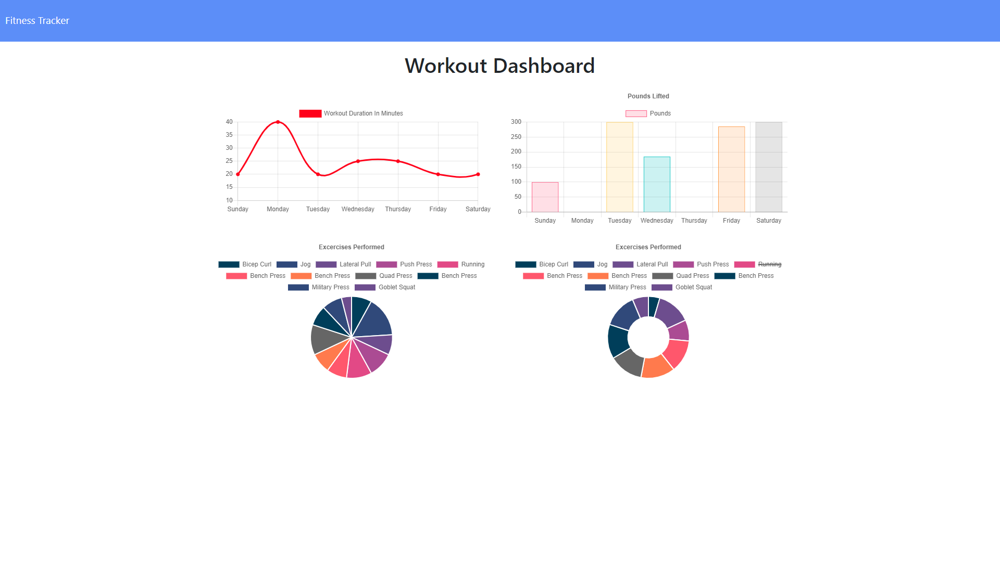

# 17: Nosql Workout Tracker

## Description
This project is a web app workout tracker that uses Express for routing and MongoDB/Mongoose for data modeling and storage. Users can create workouts by defining cardio or resistance exercises and adding them to the DB, or continue a workout by adding an exercise to the current one. By clicking on the header in the top left, the view can be switched to a display of statistics.

## Live Version
This website is available for use on [Heroku](https://young-lowlands-32044.herokuapp.com/).

## Preview
